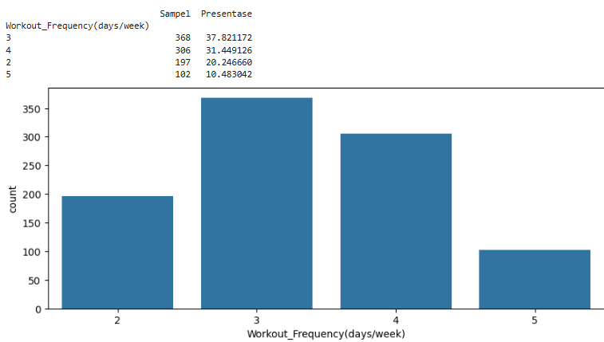
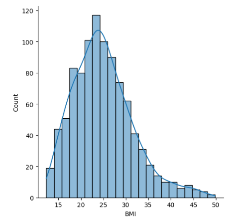
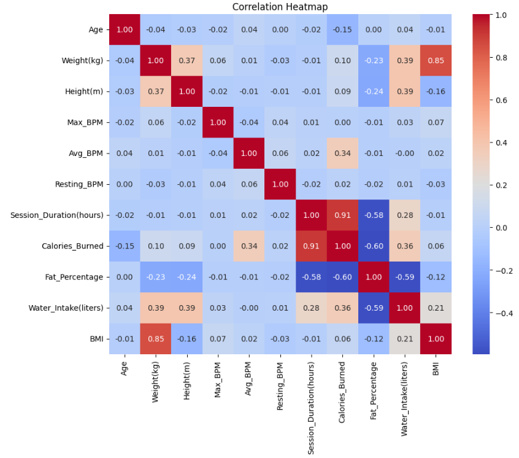
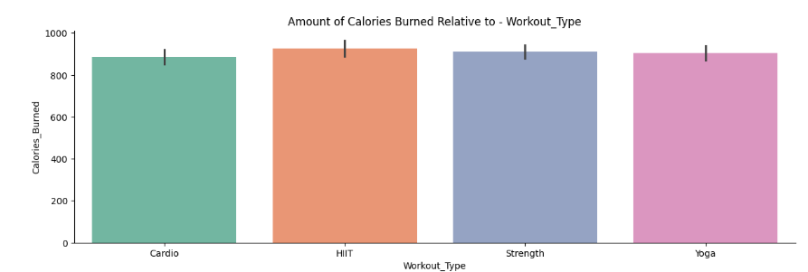
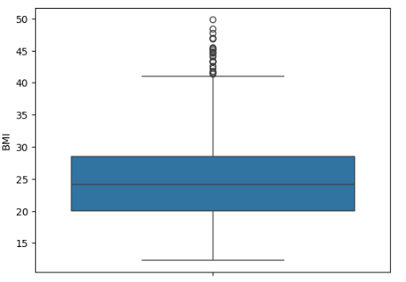
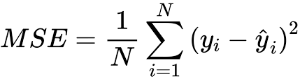
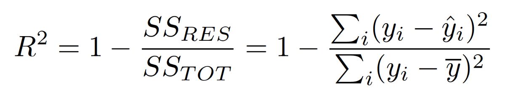

# Laporan Proyek Machine Learning - Albertus Arga S
## Project Domain:

Globally, obesity is on the rise, with projections suggesting that by 2030, 38% of the world's adult population will be overweight and another 20% obese [1]. In Indonesia, obesity has increased from 8% in 2007 to 21,8% of the population in 2018 [2]. This trend underscores the need for global health strategies to address the obesity epidemic and its associated health risks. Obesity significantly raises the risk of various diseases, including type 2 diabetes, cardiovascular diseases, certain cancers, and respiratory disorders. It also contributes to reduced life expectancy and quality of life [3]. Obesity can be avoided by having weight loss.

Weight loss is influenced by a variety of factors, including behavioral, physiological, and genetic components. Understanding these factors can help tailor more effective weight loss strategies. One of the most important factor is Exercise. Exercise alone can lead to modest weight loss [4]. There many types of exercises, for example Aerobic/Cardio which improve cardiovascular health[5], Resistance/muscle-strengthening which build muscle strength[6], and alternatives exercises like yoga and dance[7].

This research tries to identify how different types of exercises may affect someone's calorie expenditure, while also factoring in other factors like age, weight, and duration of exercise to determine what factor have the most impact in determining calorie expenditure.

Citation: 
[1] Smith, K., & Smith, M. (2016). Obesity Statistics. Primary care, 43 1, 121-35, ix . https://doi.org/10.1016/j.pop.2015.10.001.

[2] Rokom, “Sering Dianggap Menggemaskan, Obesitas Membahayakan Masa Depan Anak,” Sehat Negeriku, Mar. 06, 2024. https://sehatnegeriku.kemkes.go.id/baca/rilis-media/20240306/1545063/sering-dianggap-menggemaskan-obesitas-membahayakan-masa-depan-anak/ (accessed Dec. 09, 2024).

[3] Blüher, M. (2019). Obesity: global epidemiology and pathogenesis. Nature Reviews Endocrinology, 15, 288-298. https://doi.org/10.1038/s41574-019-0176-8.

[4] Shaw, K., Gennat, H., O'Rourke, P., & Mar, C. (2006). Exercise for overweight or obesity. The Cochrane database of systematic reviews, 4, CD003817 . https://doi.org/10.1002/14651858.CD003817.PUB3.

[5] Millstein, R. (2020). Aerobic exercise. In Encyclopedia of Behavioral Medicine (pp. 61-62). Cham: Springer International Publishing.

[6] Brown, L. E. (2007). Strength training. Human Kinetics.

[7] Marschin, V., & Herbert, C. (2021). Yoga, Dance, Team Sports, or Individual Sports: Does the Type of Exercise Matter? An Online Study Investigating the Relationships Between Different Types of Exercise, Body Image, and Well-Being in Regular Exercise Practitioners. Frontiers in Psychology, 12. https://doi.org/10.3389/fpsyg.2021.621272.
‌
### Business Understanding:

#### Problem Statements:
1. What is the best model to predict calorie expenditure?
2. There are many factors that affect calorie expenditure, what factor is the most relevant?
3. Does different exercises greatly affect how much calories are burned?
    
#### Goals:
1. Identify the model that provides the best accuracy for predicting calorie expenditure
2. Determine the most relevant features to predict calorie expenditure
3. Determine whether or not different exercises affect calorie expenditure greatly
   
#### Solutions:

1. Simple Linear Regression: A basic regression approach that models the relationship between one predictor and calorie expenditure. Model accuracy can be measured with MAE or MSE
2. Random Forest Regression: A tree-based ensemble model that uses multiple decision trees to predict calorie expenditure. Model accuracy can be measured with MAE or MSE. It also determines the most relevant features.
3. XGBoost Regression: An advanced gradient boosting technique that iteratively improves predictions by minimizing errors. Model accuracy can be measured with MAE or MSE. It also determines the most relevant features.

#### Impact:
Contribution to Science:
Identifying the most influential factors in calorie expenditure contributes to sports science and human physiology, providing deeper insights into metabolic functions and energy dynamics.

### Data Understanding:
#### Dataset Description:
The Gym Members Exercise Dataset contains information related to gym members' characteristics, their exercises, and associated calorie expenditure. The key components of understanding the dataset involve assessing its features and their potential influence on calorie burn predictions.
#### Dataset Link:
https://www.kaggle.com/datasets/valakhorasani/gym-members-exercise-dataset/data
#### Info:
- There are 973 rows of data
- There are no rows with null values
- There are no duplicates
#### Features:
Member Characteristics:
- Age: Age of the gym member.
- Gender: Gender of the gym member (Male or Female).
- Weight (kg): Member’s weight in kilograms.
- Height (m): Member’s height in meters.
- Fat_PercentageFat_Percentage: Body fat percentage of the member.
- Water_Intake (liters): Daily water intake during workouts.
- Experience_Level: Level of experience, from beginner (1) to expert (3).
- BMI: Body Mass Index, calculated from height and weight.
  
Exercise Details:
- Workout_Type: Type of workout performed (e.g., Cardio, Strength, Yoga, HIIT).
- Session_Duration (hours): Duration of each workout session in hours.
- Max_BPM: Maximum heart rate (beats per minute) during workout sessions.
- Avg_BPM: Average heart rate during workout sessions.
- Resting_BPM: Heart rate at rest before workout.
- Workout_Frequency (days/week)	: Number of workout sessions per week.
  
Target Variable:
- Calories_Burned: : Total calories burned during each session. (Target)
#### Steps to Understand Data:
Basic Data Inspection:
- Use data.info() to check data types and null values.
- Use data.describe() to summarize numerical variables.
  
Univariate Analysis:
- Countplot
  Example: 
  
  
- Distribution Plot
  Example: 
  
  
Multivariate Analysis:
- Heatmap
  Example: 
  
- Barplot
  Example: 
  
  
Outlier Detection:
- Boxplot
- Example: 
  

### Data Preparation:
#### Removing Outliers:
Why Needed: Outliers can skew model predictions.

#### Binning Continuous Variables:
Why Needed: Simplifies the analysis of continuous variables (e.g., age).

#### Scaling:
Why Needed: Features may have different units and ranges, affecting model performance.

#### Encoding Categorical Variables:
Why Needed: Machine learning models like XGBoost require numeric inputs.

#### Splitting Data:
Why Needed: Prevents data leakage

### Modeling:
#### Simple Linear Regression:
##### How it works:
Models the relationship between one independent variable and a dependent variable by fitting a straight line.
##### Advantage:
Simplicity: Easy to implement and interpret.
##### Disadvantage:
Assumes Linearity: Cannot capture complex, non-linear relationships.

#### Random Forest Regression:
##### How it works:
An ensemble method that uses multiple decision trees on random subsets of data and averages their predictions. Parameters used are n_estimators = 100 (This parameter specifies the number of decision trees in the forest, generally more trees produce higher accuracy, but increase computation), and random_state = 42 (This parameter ensures reproducibility by setting the seed for the random number generator, it guarantees that the model produces the same results every time).
##### Advantage:
Handles Non-Linearity: Can model complex relationships
Robust to Outliers: Less sensitive to extreme values due to averaging.
##### Disadvantage:
Black Box Nature: Less interpretable than linear regression.

#### XGBoost Regression:
##### How it works:
A gradient boosting algorithm that builds decision trees iteratively, correcting errors from previous iterations. Parameters used are n_estimators = 100 (Specifies the number of boosting rounds/trees to be built, higher value allows the model to fit more complex patterns), learning_rate = 0.1 (Determines the step size during gradient descent, Lower values make the model learn slowly), max_depth = 3 (Sets the maximum depth of each decision tree, Limits tree complexity to prevent overfitting.), random_state = 42 (Fixes the random seed for reproducibility.).
##### Advantage:
High Performance: Often achieves state-of-the-art accuracy for structured/tabular data.
##### Disadvantage:
Computationally Intensive: Training can be slow for very large datasets.

### Evaluation:
#### Mean Squared Error:
MSE is a metric used to measure the average squared difference between the actual and predicted values in regression models. 

#### Feature Importance:
Feature importance quantifies the contribution of each input feature to the predictive power of a machine learning model. It helps in understanding the relative importance of predictors and their impact on the target variable.
#### R²:
R² is a statistical measure that indicates how well a regression model explains the variability of the target variable  based on the predictor variables. It is commonly used to evaluate the goodness of fit for regression models. 

### Insights
1. From the Scatterplot, we can see that calories burned are highly correlated with Session_Duration(hours)

2. From Barplots, there are no big difference in calories burned between types of exercises

3. From the simple linear model, Session_Duration(hours) captures most of the variability in the data (82%), but it has a high value of MSE of 11849 and  12834.

5. From the RF Regressor,  Session_Duration(hours) is the most relevant feature with a value of 0.82. The model captures 98% of variability, but the training MSE (279) is way lower than the test MSE (1343), which could indicate that the model overfitted. 
    
6. From the XGB Regression, Session_Duration(hours) is the most relevant feature with a F-Score value of 261. The model captures 99% of variability. The training MSE is quite low (150), with not too big of a difference compared to test MSE (328).

Therefore, XGB Regressor is the best model to predict calorie expenditure.

This also means that the type of exercise isn't the most important factor to burn calories, but how long people exercise for.

### Conclusion
1. **What is the best model to predict calorie expenditure?**

   XGB Regressor is the best model to predict calorie expenditure.
   
2. **There are many factors that affect calorie expenditure, what factor is the most relevant?**

   Session_Duration(hours) is the most relevant feature.

3. **Does different exercises greatly affect how much calories are burned?**

   No, what matters the most is the duration of the session.

   
### Impact
This research contributed to science by identifying the most relevant factor that determines the amount of calorie spent by exercising.
